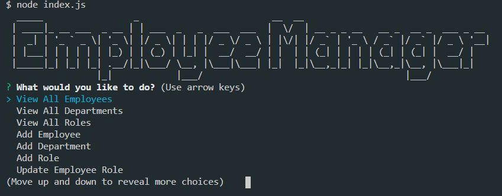
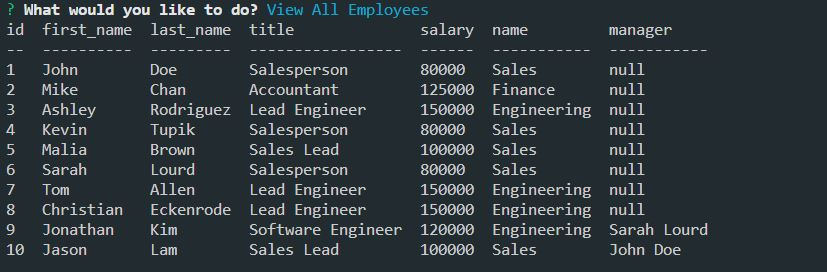

# Employee Tracker


## Table of Content

  - [Description](#description)

  - [Installation](#installation)

  - [Usage](#usage)

  - [Licence](#licence)

  - [Contributing](#contributing)

  - [Questions](#questions)

 ### Description
 
 Employee Tracker is a Content Management System that can be used to manage a company's employees. The command-line application is built using [Node](https://nodejs.org/en/), [Inquirer](https://www.npmjs.com/package/inquirer/) and [MySQL](https://www.npmjs.com/package/mysql/). Users can use Employee Tracker to perform the following tasks:
 - Add departments, roles, employees
 - View departments, roles, employees
 - Update employees roles

 <p align="center">
  
</p>

 <p align="center">
  
</p>

### Installation

The application can be installed by using the following command: 

```bash
git clone https://github.com/caymanh/employee-tracker.git
```

### Usage

The application can be invoked by using the following command: 

```bash
node index.js
```

### Licence

This application is covered by the [MIT](https://choosealicense.com/licenses/mit/) licence.

### Contributing

Pull requests are welcome. For major changes, please open an issue first to discuss what you would like to change.

### Questions

Please contact me if you have any questions regarding the application:

[Github](https://github.com/caymanh)

[Email](mailto:hengcayman@gmail.com)


